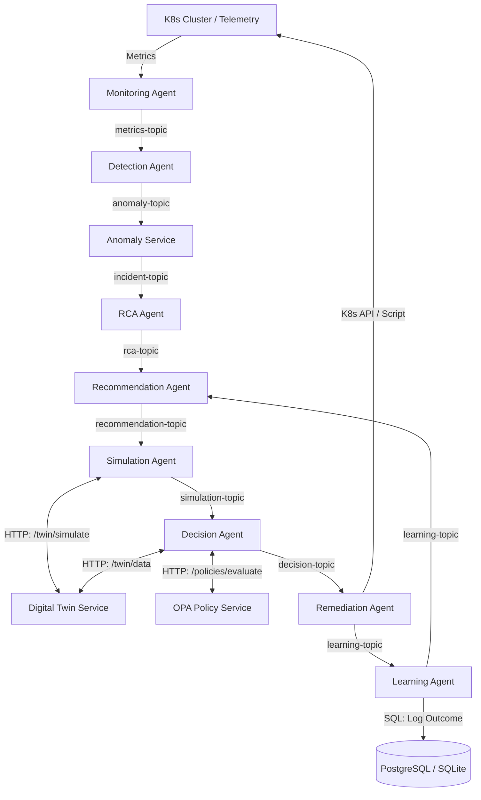

# HECATE v2.0 Software Architecture Document (SAD)

## 1. Architectural Vision
HECATE is an AI-native control system and platform engineering control plane designed for autonomous infrastructure self-healing and predictive reliability. The platform is structured as an event-driven, microservices-based monorepo where specialized autonomous agents communicate asynchronously over a messaging bus, backed by specialized REST services for policy, graph topology, and simulation.

Under HECATE v2.0, the architecture evolves from a reactive decision pipeline into a **closed-loop cognitive system** powered by a virtual infrastructure twin and sequential simulation modeling.

---

## 2. Architectural Principles
* **AP-01: Event-driven Loose Coupling**: Agents communicate via Kafka topics (or a zero-dependency SQLite event bus fallback) to maintain high availability and scaling independence.
* **AP-02: Agent Isolation (Single Responsibility)**: Each agent owns a specific phase of the mitigation lifecycle: Monitoring, Detection, RCA, Recommendation, Simulation, Decision, Remediation, and Learning.
* **AP-03: Simulation before Mitigation**: All non-trivial remediation actions must be simulated and scored against a virtual twin environment prior to execution.
* **AP-04: Declarative Policy Governance**: OPA-style declarative constraints govern execution boundaries, separating operational policies from remediation logic.
* **AP-05: Continuous Reinforcement Learning**: System parameters (playbook Q-values and Twin calibration accuracy) adapt dynamically via temporal difference feedback.

---

## 3. Core System Layers



1. **Telemetry & Observation Layer**
   - **Monitoring Agent**: Polls Prometheus/Kubernetes metrics, publishing raw observations.
   - **Telemetry DB (TimescaleDB/Redis)**: Holds historical telemetry context for time-series forecasting.

2. **Detection & Prediction Layer**
   - **Detection Agent**: Runs Rule-based evaluators alongside an unsupervised MLOps Isolation Forest model.
   - **Prediction Agent**: Evaluates metric trajectories to proactively predict threshold breaches.

3. **Diagnosis Layer**
   - **RCA Agent**: Runs directed acyclic topology graph traversals to resolve root cause dependencies.
   - **Graph Service**: Rest API managing runtime knowledge graph state (Neo4j or Python NetworkX fallback).

4. **Reliability Intelligence & Simulation Layer (New in v2.0)**
   - **Recommendation Agent**: Ranks candidate playbooks using historical operational memory and Q-values.
   - **Simulation Agent**: Coordinates simulation runs for multi-action playbook sequences.
   - **Digital Twin Service**: A virtual representation of multi-cloud cluster environments simulating MTTR, cost, and blast radius.

5. **Mitigation & Governance Layer**
   - **Decision Engine**: Combines OPA-style constraints, Execution Validator state checks, and twin simulated risk to authorize action.
   - **Remediation Agent**: Deploys pod restarts, HPAs, and rollbacks on target clusters.

6. **Feedback & Continuous Adaptation Layer**
   - **Learning Agent**: Evaluates playbook effectiveness post-remediation and logs records to operational memory.
   - **Temporal Difference Q-Learning**: Adjusts state-action weights dynamically to continuously refine recommendation precision.

---

## 4. HECATE v2.0 Core Cognitive Enhancements

### 4.1 Digital Twin & Calibrator Loops
The `digital-twin-service` models multi-cloud Kubernetes clusters (AWS, GCP, Azure). When candidate playbooks are simulated, the service returns predicted MTTR, cost, blast radius, and a **Twin Confidence Score** calculated as:
$$\text{Confidence} = \text{Calibration Accuracy} \times \text{Telemetry Completeness} \times \text{Topology Freshness}$$
Calibration accuracy converges dynamically via a post-execution calibration endpoint (`POST /twin/calibrate`) using a Temporal Difference calculation to compute the error:
$$\delta = | \text{Actual MTTR} - \text{Predicted MTTR} |$$

### 4.2 OPA Policy Engine Integration
Decloupled declarative OPA-style YAML constraints govern allowed behaviors. The `policy-service` evaluates policies dynamically:
```yaml
policies:
  - id: pol-db-no-migrate
    match:
      service_type: database
      action: migrate_service
    effect: reject
```

### 4.3 Execution Validator Gate
The `decision-agent` utilizes an Execution Validator check before executing decisions:
1. **Liveness**: Checks if target service exists in the cluster twin topology.
2. **Freshness**: Rejects plan if topology freshness is below critical threshold.
3. **State Guard**: Aborts execution if the incident status has already moved to remediated, closed, or aborted.

---

## 5. Persistence Contracts
- **PostgreSQL**: Implements schemas for policies, operational memory logging, approvals audit trail, and Q-values.
- **TimescaleDB**: High-frequency metric storage.
- **hecate_events.db (SQLite Fallback)**: Multi-process event bus backing local development.